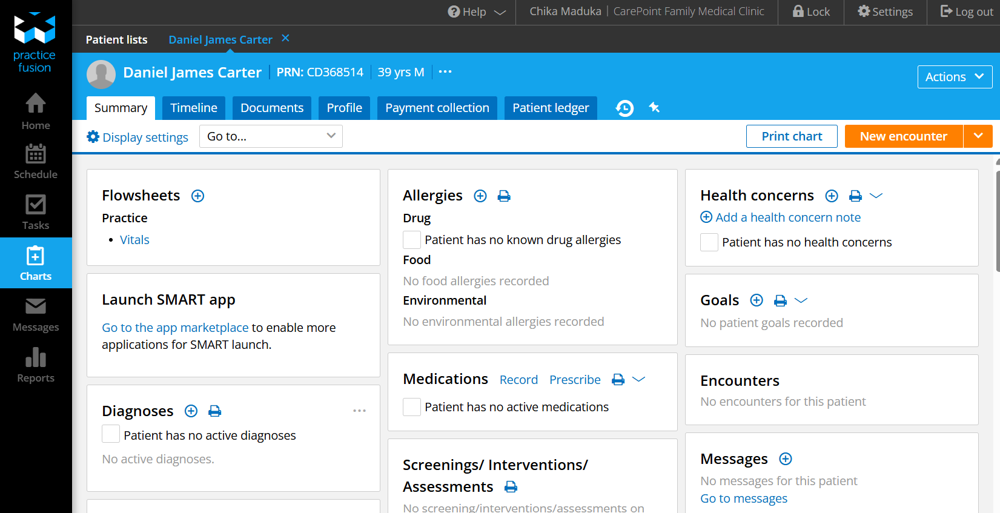
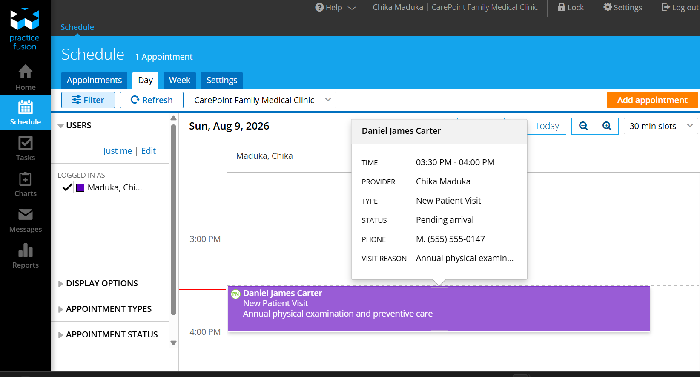
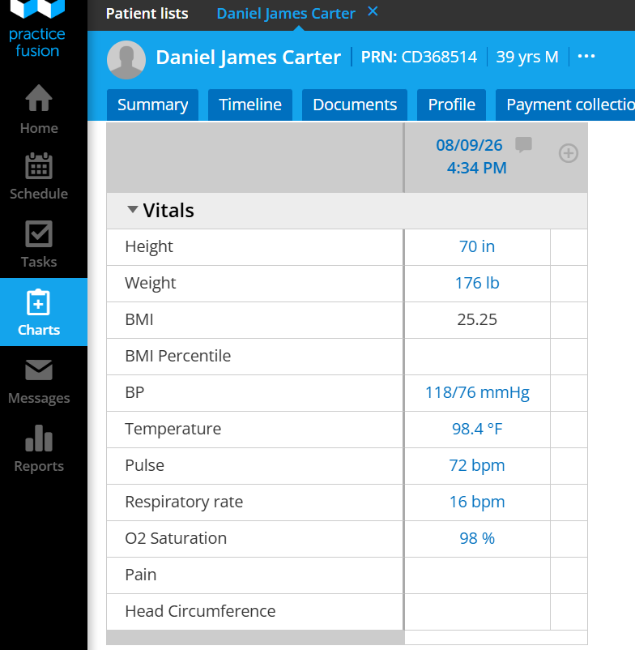
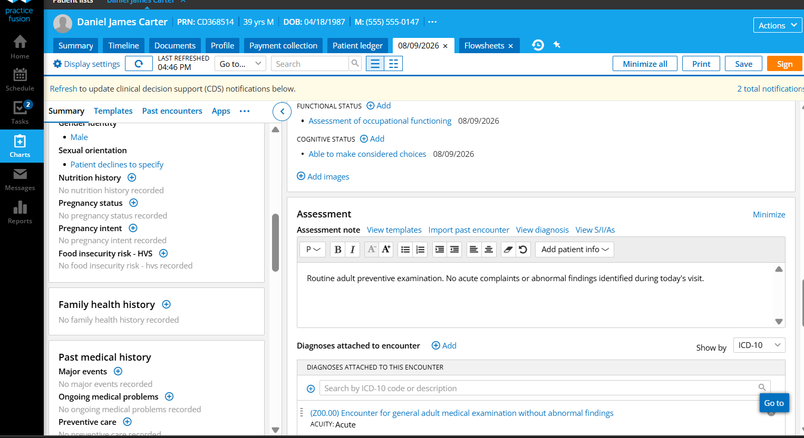
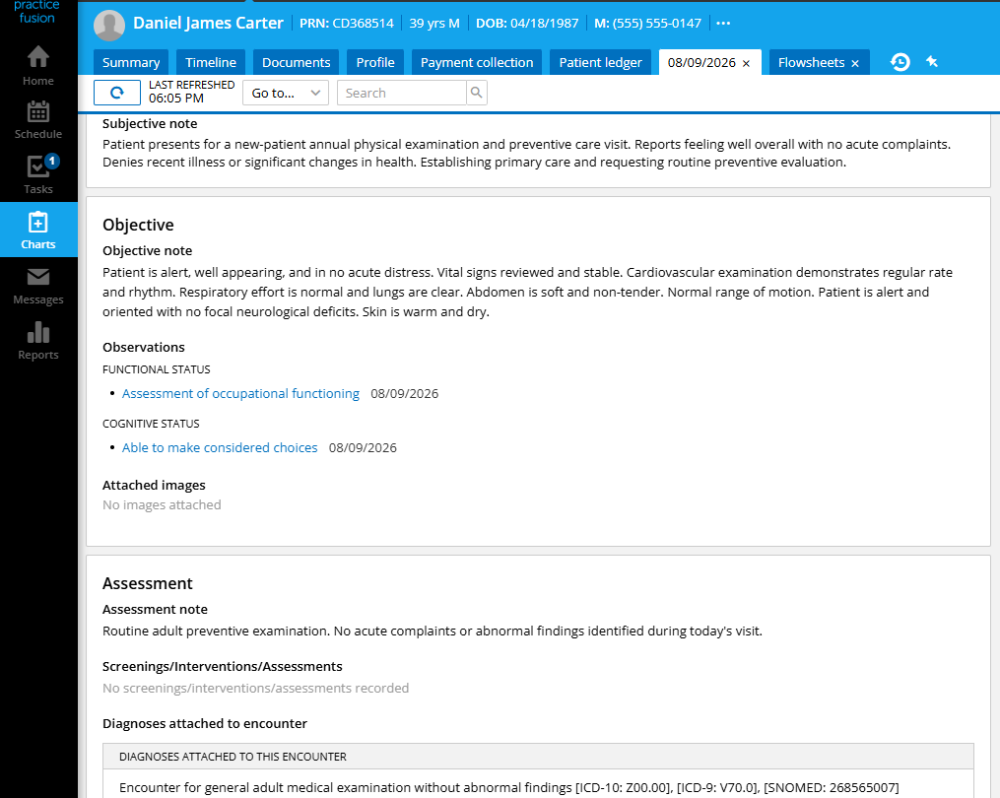
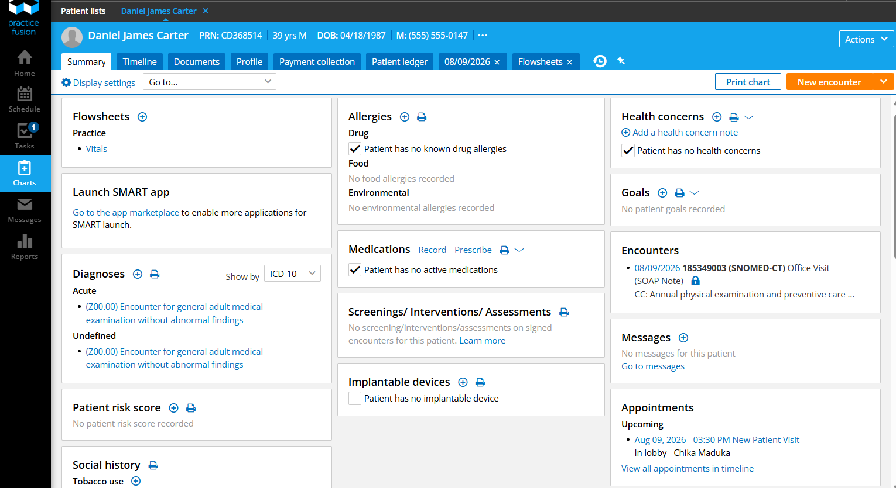

# Practice Fusion EHR Implementation

## CarePoint Family Medical Clinic

A complete **Practice Fusion Electronic Health Record (EHR)** implementation demonstrating a realistic outpatient primary care workflow from patient registration through clinical documentation and encounter completion.

---

# Project Overview

This repository showcases the implementation of **Practice Fusion** for a fictional outpatient primary care practice, **CarePoint Family Medical Clinic**.

The project demonstrates how an Electronic Health Record (EHR) supports the complete patient journey—from registration and appointment scheduling to clinical documentation, diagnosis, care planning, and encounter completion.

The implementation reflects common workflows used within primary care practices while highlighting practical navigation and documentation within the Practice Fusion platform.

---

# Practice Information

| Item | Details |
|------|---------|
| **Practice Name** | CarePoint Family Medical Clinic |
| **Platform** | Practice Fusion EHR |
| **Specialty** | Primary Care / Family Medicine |
| **Project Type** | Electronic Health Record Implementation |
| **Workflow** | Outpatient Clinical Care |

---

# Workflow

```text
Patient Registration
        ↓
Patient Chart Creation
        ↓
Appointment Scheduling
        ↓
Patient Check-In
        ↓
Clinical Encounter
        ↓
Vital Signs Documentation
        ↓
Medication & Allergy Reconciliation
        ↓
SOAP Documentation
        ↓
ICD-10-CM Diagnosis
        ↓
Preventive Care Plan
        ↓
Signed Encounter
```

---

# Patient Registration & Appointment Scheduling

The implementation begins with creating a complete patient record inside Practice Fusion.

Patient demographics, communication preferences, appointment history, allergies, medications, encounters and future clinical activities are centralized within a single electronic patient chart.

A **New Patient Visit** was then scheduled for an annual preventive examination, assigning the provider, visit type, chief complaint and appointment duration before progressing into the patient arrival workflow.

<p align="center">
  
  &nbsp;&nbsp;&nbsp;
  
</p>
---

# Clinical Encounter

Once the patient arrived, the clinical encounter was initiated.

Vital signs were documented using Practice Fusion's structured flowsheet, capturing height, weight, BMI, blood pressure, temperature, pulse, respiratory rate, oxygen saturation and pain score.

The encounter then progressed into structured clinical documentation using the SOAP format, including subjective findings, objective findings, assessment and diagnosis documentation.

<p align="center">
  
  &nbsp;&nbsp;&nbsp;
  
</p>
---

# Encounter Completion

Following clinical documentation, the SOAP note was finalized with preventive care recommendations and an ICD-10-CM diagnosis before the encounter was reviewed and signed.

The completed encounter became part of the patient's permanent electronic health record.

<p align="center">
  
  &nbsp;&nbsp;&nbsp;
  
</p>

---

# Features Demonstrated

## Patient Administration

- Patient Registration
- Patient Chart Management
- Appointment Scheduling
- Patient Check-In

## Clinical Documentation

- Vital Signs Documentation
- SOAP Documentation
- Medication Reconciliation
- Allergy Reconciliation
- Clinical Assessment
- Preventive Care Planning

## Clinical Coding

- ICD-10-CM Diagnosis Documentation

## Electronic Health Record Management

- Practice Fusion Navigation
- Outpatient Clinical Workflow
- Encounter Documentation
- Patient Timeline Management

---

# Repository Structure

```text
practice-fusion-primary-care-implementation/
│
├── README.md
│
├── screenshots/
│   ├── 01-patient-chart-summary.png
│   ├── 02-new-patient-appointment-scheduled.png
│   ├── 03-patient-vitals-documented.png
│   ├── 04-clinical-encounter-documentation.png
│   ├── 05-completed-soap-note.png
│   └── 06-signed-encounter-summary.png
│
└── docs/
    ├── 01-project-overview.md
    ├── 02-patient-registration-and-scheduling.md
    ├── 03-clinical-encounter-workflow.md
    └── 04-implementation-summary.md
```

---

# Skills Demonstrated

- Practice Fusion EHR
- Electronic Health Records (EHR)
- Patient Registration
- Appointment Scheduling
- Patient Chart Management
- Clinical Documentation
- SOAP Notes
- Vital Signs Documentation
- Medication Reconciliation
- Allergy Reconciliation
- ICD-10-CM Documentation
- Preventive Care Workflow
- Healthcare Operations
- Primary Care Workflow

---

# Live Repository

🔗 **GitHub:**  
https://github.com/cbmaduka/practice-fusion-primary-care-implementation

---

# Disclaimer

This project was created solely for portfolio and educational purposes.

**CarePoint Family Medical Clinic** is a fictional practice created for demonstration purposes, and all patient information contained within this repository is fictional and used exclusively to illustrate Practice Fusion workflows.


## 👤 Author

**Chika Blessing**

Operations • Customer Success • CRM • Project Management • Success Partner

---

*Same warmth, wherever you find me*
